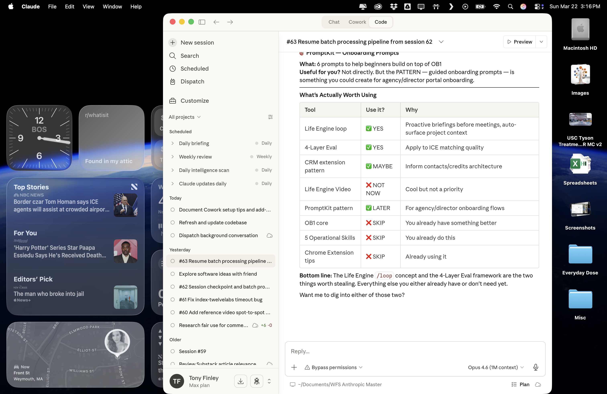
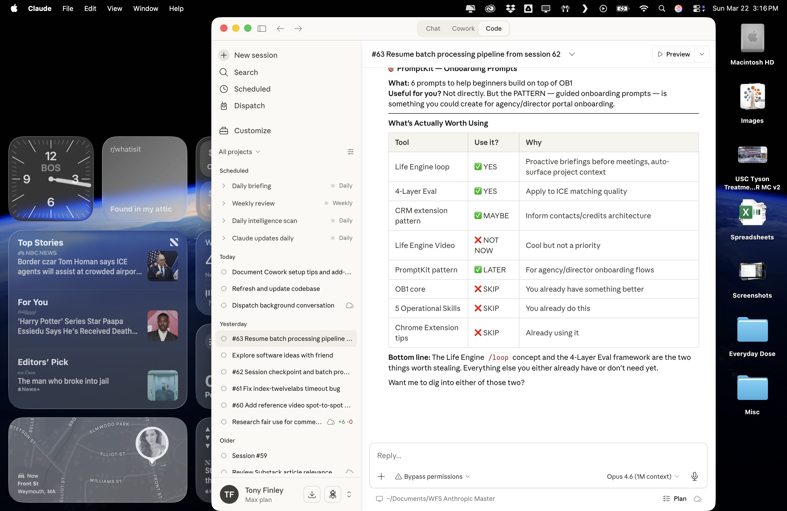

# Open Brain

**Stop your AI from forgetting your rules.**

Open Brain is a visual dashboard for managing what your AI knows, when it loads it, and how it prioritizes context. Built for people who work with AI agents every day and need persistent, structured memory that works across tools.

Works with Claude Code, Claude Desktop, ChatGPT, Cursor, or any MCP-compatible AI tool. Pairs with [Mem0](https://mem0.ai) for intelligent memory compression and deduplication. As of April 2026, includes an optional **Memory Steward** smart-query layer powered by Anthropic Managed Agents.

    

## The Problem

AI agents start every session with amnesia. You re-explain your preferences, re-state your rules, re-describe your project. Notes apps and docs don't solve this because they're flat. The AI doesn't know what to read first, what's critical vs. reference, or when to load what.

And even when you have a memory bank wired up, raw semantic recall returns noise. Ask "what's our deploy procedure" and you get back five tangentially related memories, only one of which is actually the answer. The AI then has to read all of them and guess.

## How Open Brain Solves It

**Priority-based loading.** Not all memories are equal. P1 rules load every session. P2 reference loads when relevant. P3 runbooks load before touching specific systems. P4 integrations load only when needed. Your AI boots up like an operating system, not a blank slate.

**Visual brain map.** See your entire memory hierarchy at a glance. Click any node to expand, edit, or delete. Know exactly what your AI knows.

**Semantic search.** Find any memory by meaning, not keywords. Powered by pgvector embeddings.

**Works across tools.** One memory bank, any AI tool. Claude Code at work, ChatGPT on your phone, Cursor in your IDE — they all read from the same brain.

**(New, April 2026) Smart query layer via Memory Steward.** A dedicated Anthropic Managed Agent sits in front of your raw memory and does the work raw recall doesn't: reformulates queries for better embedding matches, runs multiple parallel searches, re-ranks results by actual usefulness (not raw similarity), filters out duplicates and stale entries, and synthesizes one good answer with cited memory IDs. Slower than raw recall (10-40s) but dramatically more relevant.

**(New) Auto-load at session start.** A single SessionStart hook script reads your N most recent memories at the beginning of every Claude Code session and injects them as context, so the AI literally starts the conversation already knowing what happened yesterday.

**(New, late April 2026) Recall quality upgrades.** Five features underneath Memory Steward that raise the ceiling on what raw recall returns: hybrid search (vector + BM25 + recency), retrieval miss tracking with classified failure reasons, aggregate queries on bank shape, audit-preserving memory corrections, and directed knowledge-graph edges between memories. See [docs/recall-quality.md](docs/recall-quality.md). Inspired in part by Peter Simmons' [engram-go](https://github.com/petersimmons1972/engram-go).

## Screenshots

### Brain Map — Visual Memory Hierarchy


### Editor — Priority-Based Memory Files


## Who This Is For

- **AI power users** who work with Claude/GPT daily and are tired of re-explaining context
- **Developers** building with AI agents who need persistent project memory
- **Teams** that want shared AI context (rules, preferences, guardrails) across members
- **Anyone** who's said "I already told you this last session"

## Why Not Just Use Notes?

| | Notes/Docs | Open Brain |
|---|---|---|
| Priority loading | No | P1-P4 system |
| Semantic search | No | pgvector embeddings |
| Smart query (re-rank, dedup) | No | Memory Steward Managed Agent |
| Agent-readable | Copy-paste | MCP protocol (native) |
| Session boot sequence | Manual | Automatic checklist |
| Auto-load on session start | No | SessionStart hook |
| Mid-session refresh | Start over | `/refresh` command |
| Multi-tool | Per-app | One brain, any tool |

## Key Concepts

### Priority-Based Load Order
```
P1 (Always Load)    -- Rules, guardrails, gotchas. Every session, no exceptions.
P2 (Reference)      -- Tech stack, pipeline, workflow. When working on related systems.
P3 (Runbooks)        -- How-to guides, specs, roadmap. Before touching these systems.
P4 (Integrations)   -- Third-party setup docs. Only when relevant.
```

### Session Start Checklist
Your AI agent follows this boot sequence every session:
1. Load P1 rules (non-negotiable)
2. Load recent context (last session checkpoint)
3. Read table of contents (know what exists, don't load everything)
4. Ask what you're working on
5. Load specific memories on-demand as topics come up

### The /refresh Pattern
Long AI sessions cause context drift — the agent "forgets" rules loaded at the start. The `/refresh` command forces re-reading of P1 rules mid-session without starting over.

### Mem0 Integration (Recommended)
[Mem0](https://mem0.ai) adds an intelligent layer on top of Open Brain:
- **Automatic deduplication** — won't store the same fact twice
- **Memory compression** — extracts clean facts from messy conversations
- **Better relevance ranking** — 0.9 similarity scores vs. 0.5 with raw pgvector
- Supabase stays your source of truth. Mem0 makes search smarter.

### Memory Steward Smart Query (New, April 2026)
Raw semantic recall is fast but returns noise. Memory Steward is a dedicated Anthropic Managed Agent that wraps the raw recall in intelligence:

- **Query reformulation** — your "deploy command" becomes "deploy procedure for production frontend including the dangerous CLI to never use"
- **Parallel multi-search** — runs 3-5 different phrasings in parallel, gathers all candidates
- **Re-ranking** — re-scores by usefulness to your actual task, not raw cosine similarity
- **Dedup-check before save** — when called to remember something, runs a recall first to check for near-duplicates
- **Synthesized output** — returns one tight answer with cited memory IDs instead of a list of raw matches

It exposes as a single MCP tool (`memory_query`) alongside the existing 5. Use raw `recall` when you need bulk results or a category dump. Use `memory_query` when you want one good answer.

Setup recipe in [docs/memory-steward.md](docs/memory-steward.md).

### SessionStart Auto-Load Hook (New, April 2026)
Add this single hook to your `~/.claude/settings.json` and Claude Code will automatically inject your last N memories as context at the start of every session — no manual `recall` needed at the top of each conversation:

```json
{
  "hooks": {
    "SessionStart": [
      {
        "hooks": [
          {
            "type": "command",
            "command": "$HOME/.claude/hooks/session-start-memory.sh",
            "timeout": 15
          }
        ]
      }
    ]
  }
}
```

The hook script template lives at [docs/session-start-hook.md](docs/session-start-hook.md).

## Quick Start

1. Create a [Supabase](https://supabase.com) project
2. Clone this repo
3. Replace `YOUR_SUPABASE_URL` and `YOUR_SUPABASE_ANON_KEY` in `index.html`
4. Add your email to `ALLOWED_EMAILS`
5. Deploy to [Vercel](https://vercel.com)
6. (Optional) Add the SessionStart hook for auto-loading
7. (Optional, requires Anthropic API key with Managed Agents access) Stand up Memory Steward via [docs/memory-steward.md](docs/memory-steward.md)

Full setup instructions in [CLAUDE.md](CLAUDE.md) (readable by both humans and AI agents).

## Stack
- **Frontend:** Vanilla HTML/CSS/JS (no build step, single file)
- **Auth:** Supabase Auth with Google OAuth
- **Database:** Supabase (Postgres + pgvector)
- **Hosting:** Vercel
- **Memory Protocol:** MCP (Model Context Protocol)
- **Smart Layer (recommended):** Mem0 for compression, dedup, and ranking
- **Smart Query (optional, new):** Anthropic Managed Agent (Memory Steward)

## How Your AI Agent Uses This

```
Session starts
  |
  v
SessionStart hook auto-injects last 20 memories as context (new)
  |
  v
Load P1 rules (ADHD rules, project guardrails, gotchas)
  |
  v
Read table of contents (know what exists)
  |
  v
Ask: "What are we doing today?"
  |
  v
Load specific memories on-demand:
  - For one good answer: memory_query (Steward, 10-40s)  (new)
  - For bulk / category dump: recall (raw, sub-second)
  |
  v
After meaningful work, save a checkpoint
```

## Architecture

```
You <-> AI Agent (Claude/GPT/Cursor)
            |
            v
        MCP Server (personal-memory)
        |        |
        |        v
        |    Memory Steward Managed Agent (new, optional)
        |        |
        |        v
        v    Orchestrator (executes Steward's tool calls)
       Mem0 (smart layer - recommended)
            |
            v
        Supabase (source of truth)
            |
            v
        Open Brain Dashboard (visual UI)
```

The Memory Steward path is optional — the older direct `recall` / `remember` path still works. Adding the Steward gives you smarter recall without breaking anything that already works.

## What's New (Changelog)

### April 2026 — Memory Steward release
- New `memory_query` MCP tool: smart query layer via Anthropic Managed Agent
- New SessionStart hook: auto-load N most recent memories at every session start
- New optional orchestrator service: drives Memory Steward sessions, executes custom tool calls against the existing Supabase memory-api, returns synthesized answers
- Full backward compatibility: legacy `remember` / `recall` / `recent_memories` / `forget` / `memory_stats` MCP tools unchanged

### See [docs/](docs/) for setup recipes:
- [docs/memory-steward.md](docs/memory-steward.md) — create the Managed Agent + stand up the orchestrator
- [docs/session-start-hook.md](docs/session-start-hook.md) — auto-load hook script + Claude Code settings.json snippet

## Contributing
PRs welcome. If you build something cool on top of this, open a PR or issue.

## License
MIT
