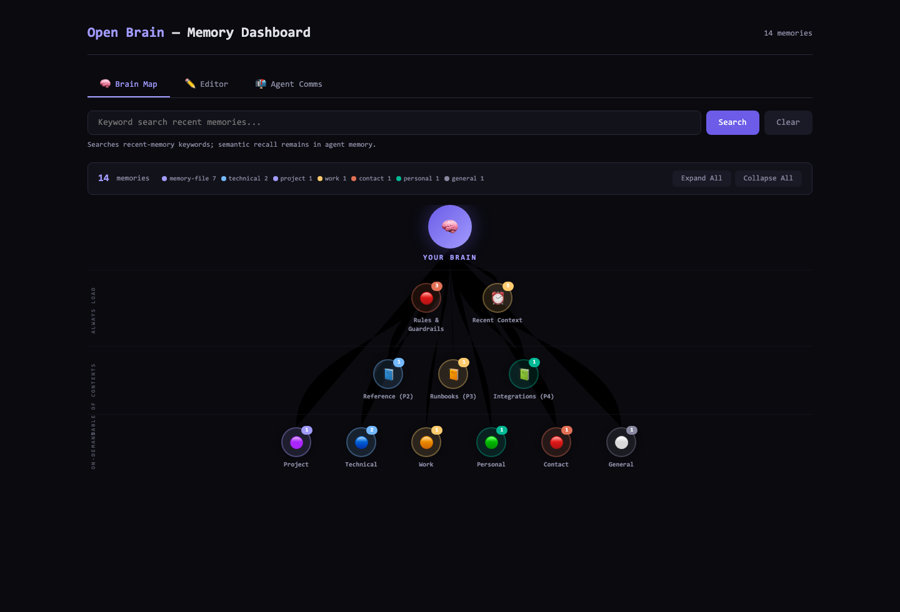
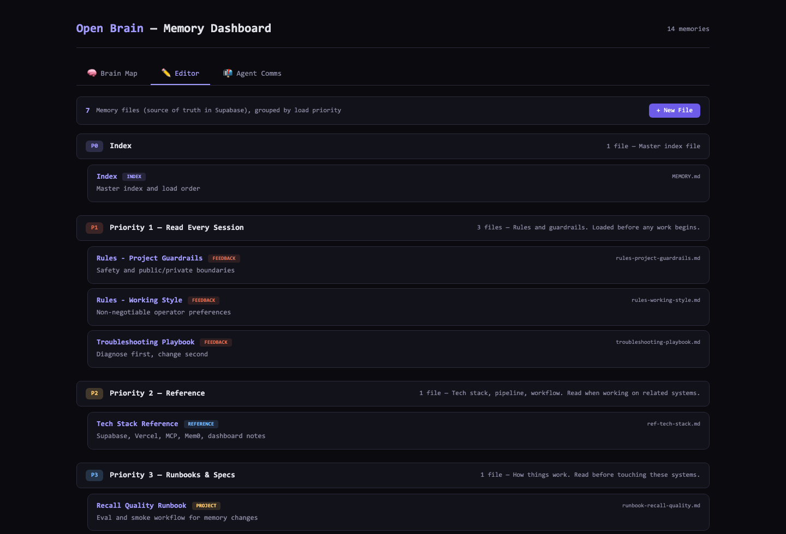

# Open Brain + Prime Radiant - Open-Source AI Agent Memory Dashboard and Operating Board for Claude, ChatGPT, Cursor, MCP, Supabase, and pgvector

**Persistent AI agent memory with an MCP-compatible dashboard, Supabase pgvector recall, Mem0 support, Prime Radiant operating-board docs, an Optimization Kit, and a Memory File Sync Kit.**

Open Brain is an MIT-licensed template for managing what your AI agents know, when they load it, how they prioritize context, and how multi-agent work gets tracked. It gives Claude Code, Claude Desktop, ChatGPT, Cursor, and other MCP-compatible tools one persistent memory bank with visual editing, honest dashboard keyword search, agent recall, Prime Radiant operating-board patterns, and repeatable optimization checks.

Works with Claude Code, Claude Desktop, ChatGPT, Cursor, or any MCP-compatible AI tool. Pairs with [Mem0](https://mem0.ai) for intelligent memory compression and deduplication. Includes optional Memory Steward docs for a smart-query layer that can reformulate, re-rank, deduplicate, and cite memory results.

    

New to AI memory systems? Start with [Give This Repo to Your AI](docs/give-this-to-your-ai.md). It is a plain-English setup brief you can paste into Claude, ChatGPT, or Cursor so your assistant can read the repo with the right boundaries.

## The Problem

AI agents start every session with amnesia. You re-explain your preferences, re-state your rules, re-describe your project. Notes apps and docs don't solve this because they're flat. The AI doesn't know what to read first, what's critical vs. reference, or when to load what.

And even when you have a memory bank wired up, raw recall or search can return noise. Ask "what's our deploy procedure" and you get back five tangentially related memories, only one of which is actually the answer. The AI then has to read all of them and guess.

## How Open Brain Solves It

**Priority-based loading.** Not all memories are equal. P1 rules load every session. P2 reference loads when relevant. P3 runbooks load before touching specific systems. P4 integrations load only when needed. Your AI boots up like an operating system, not a blank slate.

**Visual brain map.** See your entire memory hierarchy at a glance. Click any node to expand, edit, or delete. Know exactly what your AI knows.

**Agent comms view.** Track prompt/response artifacts saved by multiple agents as lightweight pointer memories tagged `agent-artifact`, with from/to/topic/date/priority columns and click-throughs to the source file path.

**Prime Radiant operating board.** Turn memory, agent artifacts, Chevrons, splices, gates, assignment state, write-back receipts, and rollback plans into one operating board for multi-agent work. The public package includes the model, staged implementation path, write-back safety contract, prompt, and report templates. See [docs/prime-radiant.md](docs/prime-radiant.md).

**Agent roster and project tags.** Define which agents exist, what they can own, which project or lane tags apply, and which operations they are allowed to perform. Prime Radiant uses this roster to make ownership visible before any assignment changes happen.

**Memory Red-Team / Seldon Crisis Guard.** Surface stale memories, duplicate memories, contradictory memory, bad recall, missing proof, stale Chevrons, and unsafe gate claims before they become trusted context. Start observe-only, then add park/block behavior only after false-positive rates are acceptable.

**Agent semantic recall.** Let your AI retrieve memory by meaning through the memory API and pgvector embeddings. The dashboard search is intentionally labeled as keyword search unless you wire and prove semantic dashboard search separately.

**Works across tools.** One memory bank, any AI tool. Claude Code at work, ChatGPT on your phone, Cursor in your IDE — they all read from the same brain.

**Optional smart query layer via Memory Steward.** A dedicated memory steward can sit in front of raw recall and do the work raw recall does not: reformulate queries for better embedding matches, run multiple parallel searches, re-rank results by actual usefulness, filter duplicates and stale entries, and synthesize one good answer with cited memory IDs. Slower than raw recall, but designed for higher relevance.

**(New) Auto-load at session start.** A single SessionStart hook script reads your N most recent memories at the beginning of every Claude Code session and injects them as context, so the AI literally starts the conversation already knowing what happened yesterday.

**Recall quality upgrades.** Five features underneath Memory Steward that raise the ceiling on what raw recall returns: hybrid search (vector + BM25 + recency), retrieval miss tracking with classified failure reasons, aggregate queries on bank shape, audit-preserving memory corrections, and directed knowledge-graph edges between memories. See [docs/recall-quality.md](docs/recall-quality.md). Inspired in part by Peter Simmons' [engram-go](https://github.com/petersimmons1972/engram-go).

**Optimization Kit.** Scripts, prompts, templates, smoke checks, and playbooks for improving an Open Brain without mixing up speed, quality, shadow builds, and production. See [docs/optimization-kit.md](docs/optimization-kit.md).

**Memory File Sync Kit.** Optional scripts for keeping local markdown memory files aligned with Open Brain `memory-file` rows. No scheduler is auto-enabled; use it only if you want file-based memory editing. See [docs/memory-file-sync.md](docs/memory-file-sync.md).

## Screenshots

These are sanitized template screenshots, not a private production memory bank. The dashboard screenshot also shows the public template's keyword-search boundary; semantic recall remains an agent-memory path unless you wire and prove semantic dashboard search separately.

### Brain Map - Visual Memory Hierarchy


### Editor - Priority-Based Memory Files


## Who This Is For

- **AI power users** who work with Claude/GPT daily and are tired of re-explaining context
- **Developers** building with AI agents who need persistent project memory
- **Teams** that want shared AI context (rules, preferences, guardrails) across members
- **Anyone** who's said "I already told you this last session"

## Why Not Just Use Notes?

| | Notes/Docs | Open Brain |
|---|---|---|
| Priority loading | No | P1-P4 system |
| Agent semantic recall | No | pgvector embeddings |
| Smart query (re-rank, dedup) | No | Memory Steward smart-query layer |
| Multi-agent operating board | No | Prime Radiant |
| Agent ownership map | No | Agent roster + project tags |
| Drift and crisis guard | No | Memory Red-Team / Seldon Crisis Guard |
| Agent-readable | Copy-paste | MCP protocol (native) |
| Session boot sequence | Manual | Automatic checklist |
| Auto-load on session start | No | SessionStart hook |
| Mid-session refresh | Start over | `/refresh` command |
| Multi-tool | Per-app | One brain, any tool |

## Key Concepts

### Priority-Based Load Order
```
P1 (Always Load)    -- Rules, guardrails, gotchas. Every session, no exceptions.
P2 (Reference)      -- Tech stack, pipeline, workflow. When working on related systems.
P3 (Runbooks)        -- How-to guides, specs, roadmap. Before touching these systems.
P4 (Integrations)   -- Third-party setup docs. Only when relevant.
```

### Session Start Checklist
Your AI agent follows this boot sequence every session:
1. Load P1 rules (non-negotiable)
2. Load recent context (last session checkpoint)
3. Read table of contents (know what exists, don't load everything)
4. Ask what you're working on
5. Load specific memories on-demand as topics come up

### The /refresh Pattern
Long AI sessions cause context drift — the agent "forgets" rules loaded at the start. The `/refresh` command forces re-reading of P1 rules mid-session without starting over.

### Prime Radiant
Prime Radiant is the operating-board layer on top of Open Brain. It answers the questions memory alone cannot:

- Which agent owns this lane?
- Which plan or sub-plan is active?
- What proof exists?
- What gate is still blocked?
- What changed since the last checkpoint?
- Is this a read-only observation, an interactive planning move, or a real assignment write?

The public package includes:

- **Chevrons** - current position markers for plans and lanes.
- **Seldon Plans** - durable plans or roadmaps.
- **Splices** - sub-plans or branch lanes under a larger plan.
- **Seldon Crises** - plan-vs-reality drift, stale evidence, bad recall, or blocked gates.
- **Agent Roster + Project Tags** - agents, availability, lane tags, allowed operations, and current assignments.
- **Gate reports and closeouts** - receipts for review, merge, deploy, dry-run, live-write, rollback, and publish decisions.
- **Write-back safety contract** - off-switch, dry-run default, audit receipt, idempotency, rollback, and no browser-to-database or browser-to-plan-file write path.
- **Memory Red-Team / Seldon Crisis Guard** - observe-only detection first, then park/block behavior only after false-positive rates are measured and accepted.

Start with [docs/prime-radiant.md](docs/prime-radiant.md).

### Mem0 Integration (Recommended)
[Mem0](https://mem0.ai) adds an intelligent layer on top of Open Brain:
- **Automatic deduplication** — won't store the same fact twice
- **Memory compression** — extracts clean facts from messy conversations
- **Better relevance ranking** — 0.9 similarity scores vs. 0.5 with raw pgvector
- Supabase stays your source of truth. Mem0 makes search smarter.

### Memory Steward Smart Query
Raw semantic recall is fast but can return noise. Memory Steward is an optional smart-query layer that wraps raw recall in intelligence:

- **Query reformulation** — your "deploy command" becomes "deploy procedure for production frontend including the dangerous CLI to never use"
- **Parallel multi-search** — runs 3-5 different phrasings in parallel, gathers all candidates
- **Re-ranking** — re-scores by usefulness to your actual task, not raw cosine similarity
- **Dedup-check before save** — when called to remember something, runs a recall first to check for near-duplicates
- **Synthesized output** — returns one tight answer with cited memory IDs instead of a list of raw matches

It exposes as a single MCP tool (`memory_query`) alongside the existing 5. Use raw `recall` when you need bulk results or a category dump. Use `memory_query` when you want one good answer.

Setup recipe in [docs/memory-steward.md](docs/memory-steward.md).

### SessionStart Auto-Load Hook
Add this single hook to your `~/.claude/settings.json` and Claude Code will automatically inject your last N memories as context at the start of every session — no manual `recall` needed at the top of each conversation:

```json
{
  "hooks": {
    "SessionStart": [
      {
        "hooks": [
          {
            "type": "command",
            "command": "$HOME/.claude/hooks/session-start-memory.sh",
            "timeout": 15
          }
        ]
      }
    ]
  }
}
```

The hook script template lives at [docs/session-start-hook.md](docs/session-start-hook.md).

## Quick Start

1. Create a [Supabase](https://supabase.com) project
2. Clone this repo
3. Deploy the memory backend: apply the migration and deploy the Edge Function in [supabase/README.md](supabase/README.md) -- this is what actually stores and serves memories; the dashboard alone has nothing to talk to without it
4. Replace `YOUR_SUPABASE_URL` and `YOUR_SUPABASE_ANON_KEY` in `index.html`
5. Add your email to `ALLOWED_EMAILS`
6. Deploy to [Vercel](https://vercel.com)
7. Wire up [memory-server/](memory-server/) so Claude Code, Claude Desktop, or Cursor can read/write memories via MCP
8. (Optional) Add the SessionStart hook for auto-loading
9. Add Prime Radiant operating-board structure via [docs/prime-radiant.md](docs/prime-radiant.md)
10. (Optional, advanced) Stand up Memory Steward via [docs/memory-steward.md](docs/memory-steward.md)
11. (Optional, advanced) Sync local markdown memory files with Open Brain rows via [docs/memory-file-sync.md](docs/memory-file-sync.md)

Full setup instructions are in [CLAUDE.md](CLAUDE.md). If you want your assistant to help with setup, start with [docs/give-this-to-your-ai.md](docs/give-this-to-your-ai.md).

## Stack
- **Frontend:** Vanilla HTML/CSS/JS (no build step, single file)
- **Auth:** Supabase Auth with Google OAuth
- **Database:** Supabase (Postgres + pgvector)
- **Hosting:** Vercel
- **Memory Protocol:** MCP (Model Context Protocol)
- **Smart Layer (recommended):** Mem0 for compression, dedup, and ranking
- **Smart Query (optional, advanced):** Memory Steward smart-query layer
- **Operating Board:** Prime Radiant model, Chevrons, splices, gates, assignment receipts, red-team crisis guard, and write-back safety contract

## How Your AI Agent Uses This

```
Session starts
  |
  v
SessionStart hook auto-injects last 20 memories as context (new)
  |
  v
Load P1 rules (ADHD rules, project guardrails, gotchas)
  |
  v
Read table of contents (know what exists)
  |
  v
Ask: "What are we doing today?"
  |
  v
Load specific memories on-demand:
  - For one good answer: memory_query (Steward, 10-40s)  (new)
  - For bulk / category dump: recall (raw, sub-second)
  |
  v
After meaningful work, save a checkpoint
  |
  v
Prime Radiant records lane ownership, gate state, proof, and next action
```

## Architecture

```
You <-> AI Agent (Claude/GPT/Cursor)
            |
            v
        MCP Server (memory-server/, ships in this repo)
        |        |
        |        v
        |    Memory Steward Managed Agent (new, optional)
        |        |
        |        v
        v    Orchestrator (executes Steward's tool calls)
       Mem0 (smart layer - recommended)
            |
            v
        Supabase (source of truth)
            |
            v
        Open Brain Dashboard (visual UI)
            |
            v
        Prime Radiant Board
        (Chevrons, splices, agents, gates, receipts, rollback)
```

The Memory Steward path is optional — the older direct `recall` / `remember` path still works. Adding the Steward gives you smarter recall without breaking anything that already works.

## What's New (Changelog)

### June 2026 — Prime Radiant operating-board package
- New Prime Radiant docs for turning Open Brain into an AI-agent operating board
- New Chevrons / Seldon Plans / Splices / Seldon Crises vocabulary for plan state and drift
- New Agent Roster + Project Tags pattern for lane ownership and allowed operations
- New Memory Red-Team / Seldon Crisis Guard pattern for stale memory, duplicate memory, bad recall, and blocked-gate detection
- New write-back safety contract for assignment-style operations: off-switch, dry-run default, audit receipt, idempotency, rollback, and receiver-side validation
- New templates for lanes, assignment write-back reports, and board readiness
- New Prime Radiant reviewer prompt for checking board changes without blending read-only proof, dry-run proof, deployed proof, and live-write approval

### April 2026 — Memory Steward release
- New `memory_query` MCP tool: smart query layer via Anthropic Managed Agent
- New SessionStart hook: auto-load N most recent memories at every session start
- New optional orchestrator service: drives Memory Steward sessions, executes custom tool calls against the existing Supabase memory-api, returns synthesized answers
- Full backward compatibility: legacy `remember` / `recall` / `recent_memories` / `forget` / `memory_stats` MCP tools unchanged

### May 2026 — Agent Comms pointers
- New Agent Comms dashboard tab for memories tagged `agent-artifact`
- Thread-style grouping by topic with from/to, kind, priority, date, summary, and artifact path columns
- Designed for artifact-pointer workflows where agents save durable prompt/response files and store only small Open Brain pointer memories

### See [docs/](docs/) for setup recipes:
- [docs/give-this-to-your-ai.md](docs/give-this-to-your-ai.md) — pasteable setup brief for Claude, ChatGPT, Cursor, or another AI assistant
- [docs/memory-steward.md](docs/memory-steward.md) — create the Managed Agent + stand up the orchestrator
- [docs/session-start-hook.md](docs/session-start-hook.md) — auto-load hook script + Claude Code settings.json snippet
- [docs/prime-radiant.md](docs/prime-radiant.md) — Prime Radiant operating-board model, agent roster, crisis guard, and write-back safety architecture
- [docs/optimization-kit.md](docs/optimization-kit.md) — smoke checks, evals, prompts, templates, and public playbooks for safe optimization
- [docs/memory-file-sync.md](docs/memory-file-sync.md) — optional markdown file sync scripts for `memory-file` rows

Common search phrases for this template include AI agent memory dashboard, AI agent operating board, Prime Radiant, AI agent control plane, AI agent assignment board, AI red-team memory guard, MCP memory dashboard, Claude Code memory, ChatGPT memory, Cursor memory, Supabase pgvector recall, Mem0 memory, persistent AI memory, Open Brain Optimization Kit, and Memory File Sync Kit.

## Contributing
PRs welcome. If you build something cool on top of this, open a PR or issue.

## License
MIT
